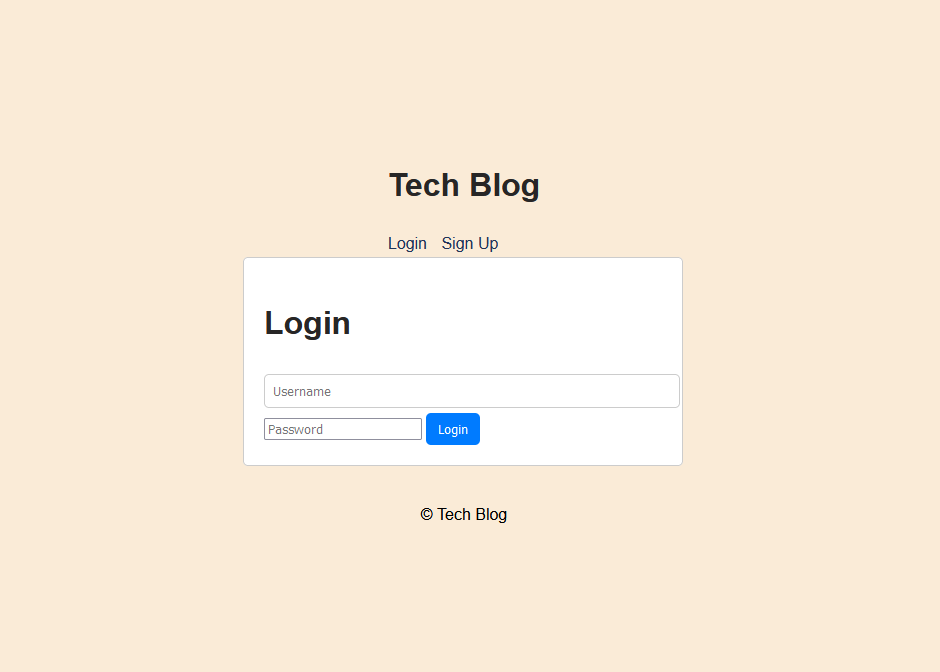
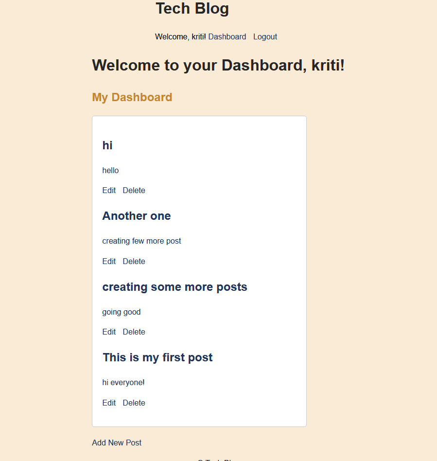

# techblog
## Description
As a tech developer who writes about technology, this CMS-style blog site provides you with a platform to publish your articles, blog posts, and thoughts and opinions. The site allows you to sign up, log in, create new blog posts, view existing posts, leave comments, update or delete your posts, and log out.

## Table of Contents
- [Technology](#technology)
- [Installation](#installation)
- [Application](#application)
- [Usage](#usage)
- [Contribution](#contribution)
- [Questions](#questions)

## Technology
- Front-end: HTML, CSS, JavaScript
- Back-end: Node.js, Express.js
- Database: MongoDB
- User Authentication: Passport.js
- Templating Engine: Handlebars

## Installation
To run the CMS-style blog site locally on your machine, follow these steps:
- Clone the repository https://github.com/KritiShrestha/techblog to your local machine.
- Set up your database and configure the connection in the .env file. By default, it uses CLEARDB_DATABASE_URL to connect to heroku mysql. If you want to connect to local mysql, please remove CLEARDB_DATABASE_URL and use your own DB_USER and DB_PASSWORD.
- Run the schema.sql in db directory to create schemas
- Install the necessary dependencies using npm install.
- Run the application using npm start.

## Application
Here's the link to the deployed application on heroku https://kriti-tech-blog-a02ec8960847.herokuapp.com/

## Usage
The CMS-style blog site allows users to sign up, log in, and publish articles, blog posts, and thoughts. Users can view existing posts on the homepage, add new blog posts from the dashboard, and interact with posts by leaving comments. The site also provides options to update or delete user-created posts and log out when done.

## Contribution
Kriti Shrestha

## Questions
You can find me on Github at [KritiShrestha](https://github.com/KritiShrestha)
Feel free to reach me out at shrkriti07@gmail.com if you have any additional questions
